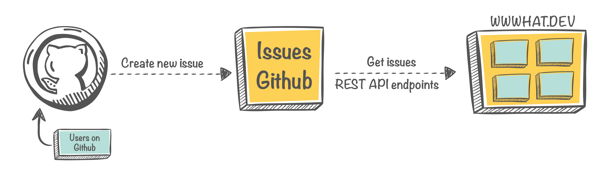
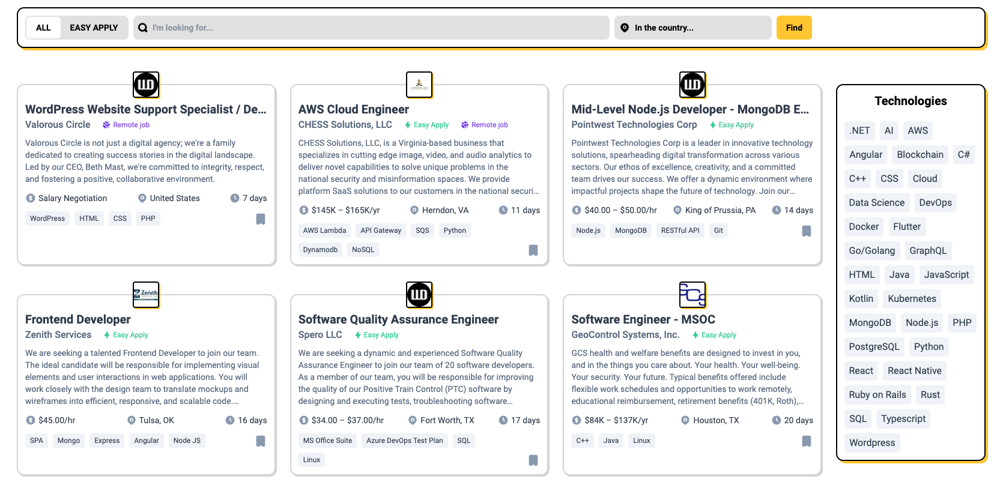

<p align="center">

<span align="center">GitHub Repository for Hiring</span>
</p>

## How It Works?

<p align="center">

</p>

When a Github user creates a new issue on Github, the website will call Github's api to get the issues in open state and exclude issues that have the label `bug`.

```txt
https://api.github.com/search/issues?q=is:issue repo:tuantvk/wwwhat.dev state:open -label:bug
```

View file config [app/constants/github.ts](/app/constants/github.ts)

Once all issues are retrieved, they will be displayed on the website. The displayed content will be based on the markup information as shown in the file below.

```md
---
company: GitHub
logoCompany: https://user-images.githubusercontent.com/logo.png
shortDescription: GitHub is where over 100 million developers...
location: San Francisco, CA, United States
technologies: Java, JavaScript, Kotlin, Kubernetes, MongoDB, Node.js, PostgreSQL, Python
isRemoteJob: true
---

Lorem Ipsum is simply dummy text of the printing and typesetting industry.
Lorem Ipsum has been the industry's standard dummy text ever since the 1500s.
```

View file [issue-template.md](/.github/ISSUE_TEMPLATE/issue-template.md)

<p align="center">

</p>

### Glossary

| Key              | Description |
|------------------|-------------|
| company          | Business name, team name,... |
| logoCompany      | Path for your logo. Only except from host `*.githubusercontent.com` [Writing on GitHub - Attaching files](https://docs.github.com/en/get-started/writing-on-github/working-with-advanced-formatting/attaching-files) |
| shortDescription | Description for business name or for jobs,... |
| location         | Address, country,... [List of Countries](/app/data/countries.ts) |
| technologies     | Technologies skills, comma separator [Technologies](/app/data/technologies.ts) |
| isRemoteJob      | Remote job (`true`, `false`, `empty`) |

## Get Started

Get started with your favorite framework:

- [Next.js](https://nextjs.org/)
- [MobX-State-Tree](https://mobx-state-tree.js.org/)
- [Tailwind CSS](https://tailwindcss.com/)

Run the development server:

```bash
yarn dev
# or
pnpm dev
# or
bun dev
```

Open [http://localhost:3000](http://localhost:3000) with your browser to see the result.

## Contributing

Here's how you can contribute:

- Find a bug? Open an issue
- Feature request? Submit a PR

## License

wwwhat.dev is [MIT licensed](LICENSE).
